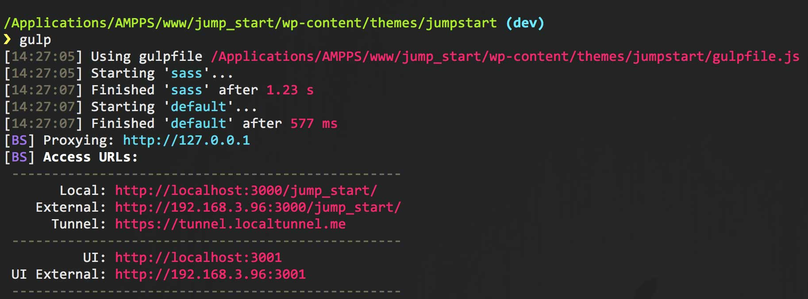

**jumpstart Install Script**
====
Simple bash script to automate installation of WordPress with my [jumpstart theme](https://github.com/elimc/jumpstart) with some of my favorite settings.

# What
This script downloads and installs the latest core version of WordPress. The installation process downloads and installs latest version of my [jumpstart theme](https://github.com/elimc/jumpstart). It also automates a bunch of other manual things, like deleting the sample page, creating a primary menu, building a list of pages, deleting the `hello dolly` plugin, installing `jetpack`, etc ... Inspiration taken from Christopher Geary's [cool script](http://www.ltconsulting.co.uk/automated-wordpress-installation-with-bash-wp-cli/).

# Working with Vagrant
If you work with a team of developers, you might want to use Vagrant. In that case, check out [jVVV](https://github.com/elimc/jumpstart-vvv).

# Dependencies
* You will need to have [WP-CLI](http://wp-cli.org/) installed. This process is so easy, my mother could install it.
* You will need to have bash installed. If you are on a Mac, you already have it.
* AMPS stack of some sort. I use [AAMPS](http://www.ampps.com/). Your site won't load without PHP and MySQL. Duh!
* Optional: If you want to use [Gulp](http://gulpjs.com/) with your project, you will need to have [Node](https://nodejs.org/) installed.

# Warnings
This script has only been tested on a MacOS.

# Use
Personally, I put `wpinstall.sh` in my custom `Scripts` directory and then alias it in `bashrc`, like so: `alias wpinstall="~/Scripts/wpinstall.sh"`. When I want to install WordPress, I use the command line to navigate to the folder I want my WordPress site installed and type `bash wpinstall`. The script will ask you a couple questions, and then it will install everything. At this point, you might want to learn a new hobby ... due to all the newfound free time you have.

# Gulp
###### Local URL
The script will ask if you would like to install Gulp and NPM. If you choose yes, the bash script will automatically enter `gulp` into the Command Line Interface (CLI), thus loading the browser with the URL [http://localhost:3000](#), after the script has completed installing everything. Any changes you make to your files in your project will automatically be refreshed on this page. In order to stop this process, simply enter `control-C` (sometimes written as `^C`) in the CLI. This will stop any Unix process. To restart this process, simply enter `gulp` in the CLI. This will load another browser window with the URL [http://localhost:3000](#).

##### External URL
While the Local URL is great for testing on your host machine, you might want to do Cross Device Testing on devices that are attached to your local WiFi. For example, you might want to see automatic SASS injection/page reloading on your tablet or phone. For these devices you will use the External URL. In the image above, the External URL is [http://10.0.1.8:3000](#). Enter the External URL that you see in your CLI into your phone or tablet. As long as they are connected to the same WiFi network as your computer, you will be synced.

##### SSH Tunneling
The default setup also comes with the ability to sync devices that are not on your local WiFi network. It does this via SSH Tunneling. One use-case for this is to test your site on an [IE9 VM](http://dev.modern.ie/tools/vms/). Another use-case would be to show your currently-in-development local site to remote clients. A client in a different country could see updates to a site on your local machine while your talk to them on the phone. They will think you possess magic.

In the image above, the URL for SSH Tunneling is https://tunnel.localtunnel.me. Enter this URL in your IE9 VM, or give it to your client, and blow people's minds.

#Author
**Eli McMakin**

* GitHub: https://github.com/elimc
* Web site: www.elimcmakin.com